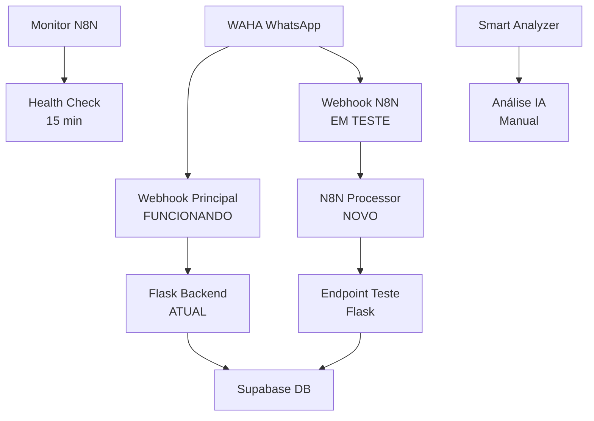

# 🔧 GUIA COMPLETO - CONFIGURAÇÃO N8N PARALELA

## 📊 **STATUS ATUAL DOS TESTES:**

✅ **Backend Flask**: Funcionando perfeitamente  
✅ **Health Check**: Sistema saudável  
✅ **Novos Endpoints**: Criados com sucesso  
⚠️ **N8N Webhook**: Precisa ser ativado (workflow inativo)  
⚠️ **Endpoint Teste**: Deploy necessário  

---

## 🎯 **PRÓXIMOS PASSOS OBRIGATÓRIOS:**

### **PASSO 1: Deploy das Melhorias**
Suas melhorias no código estão locais. Você precisa fazer deploy no Render:

```bash
# Fazer commit das mudanças
git add .
git commit -m "feat: adicionar endpoints teste integração N8N"
git push origin main
```

### **PASSO 2: Configurar Credenciais Supabase no N8N**

1. **Acesse**: https://agenteia-n8n.dqlhjk.easypanel.host/
2. **Login** com suas credenciais
3. **Ir para**: Settings → Credentials
4. **Criar nova credencial**:
   - **Tipo**: Supabase
   - **Nome**: `Supabase LDC`
   - **Host**: `wsoxukpeyzmpcngjugie.supabase.co`
   - **Service Role Key**: Sua chave do Supabase

### **PASSO 3: Ativar Workflows N8N**

No painel do N8N:

1. **Workflow "Agente LDC - Message Processor"** (ID: 0Zp4fI6yvMbgvO4a)
   - Abrir o workflow
   - Verificar credenciais Supabase
   - **ATIVAR** usando o toggle (canto superior direito)

2. **Workflow "Agente LDC - Smart Lead Analyzer"** (ID: ymw3xSkOXZHwg23O) 
   - Configurar credenciais
   - Manter **INATIVO** (trigger manual)

3. **Workflow "Agente LDC - System Monitor"** (ID: 9QgC0kG5oCV1kgU3)
   - Já deve estar ativo
   - Verificar se está monitorando

---

## 🔄 **ARQUITETURA PARALELA IMPLEMENTADA:**



### **🟢 FLUXO ATUAL** (Sistema funcionando):
WAHA → `/webhook` → Flask → Supabase

### **🟡 FLUXO TESTE** (Novo sistema):
WAHA → N8N → `/webhook-n8n-test` → Flask → Supabase

---

## 📋 **TESTES DISPONÍVEIS:**

### **Teste 1: Status da Integração**
```bash
curl https://agente-qualificador-ldc.onrender.com/n8n-integration-status
```

### **Teste 2: Endpoint N8N (após deploy)**
```bash
curl -X POST https://agente-qualificador-ldc.onrender.com/webhook-n8n-test \
  -H "Content-Type: application/json" \
  -d '{
    "processedBy": "n8n",
    "phone": "5511999999999",
    "messageId": "test_123"
  }'
```

### **Teste 3: N8N Webhook (após ativar)**
```bash
curl -X POST https://agenteia-n8n.dqlhjk.easypanel.host/webhook/waha-webhook-processor \
  -H "Content-Type: application/json" \
  -d '{
    "event": "message",
    "payload": {
      "id": "test_123",
      "from": "5511999999999@c.us",
      "fromName": "Teste",
      "body": "mensagem teste",
      "fromMe": false
    }
  }'
```

---

## 🎯 **VANTAGENS DA INTEGRAÇÃO PARALELA:**

### ✅ **Segurança Total:**
- Sistema atual continua funcionando 100%
- Nenhum risco para leads reais
- Rollback instantâneo se necessário

### ✅ **Testes Graduais:**
- Validar cada componente separadamente
- Monitorar performance comparativa
- Detectar problemas antes da migração

### ✅ **Melhorias Implementadas:**
- Anti-duplicação de mensagens ✅
- Sistema anti-loop ✅  
- Reconhecimento melhorado ✅
- Monitoramento automático ✅

---

## 🚀 **QUANDO MIGRAR COMPLETAMENTE:**

Só migre o webhook WAHA quando:

1. ✅ Deploy das melhorias feito
2. ✅ Credenciais N8N configuradas  
3. ✅ Workflows N8N ativos e testados
4. ✅ Testes manuais bem-sucedidos
5. ✅ Monitoramento funcionando
6. ✅ Performance igual ou melhor

### **Comando de Migração Final:**
```bash
# Mudar webhook WAHA de:
# https://agente-qualificador-ldc.onrender.com/webhook
# Para:
# https://agenteia-n8n.dqlhjk.easypanel.host/webhook/waha-webhook-processor
```

---

## 📞 **SUPORTE:**

Se encontrar problemas:
1. Verificar logs no Render
2. Verificar execuções no N8N
3. Testar endpoints individualmente
4. Reverter para sistema atual se necessário

**Status**: 🟡 Pronto para configuração - Aguardando deploy e credenciais N8N
